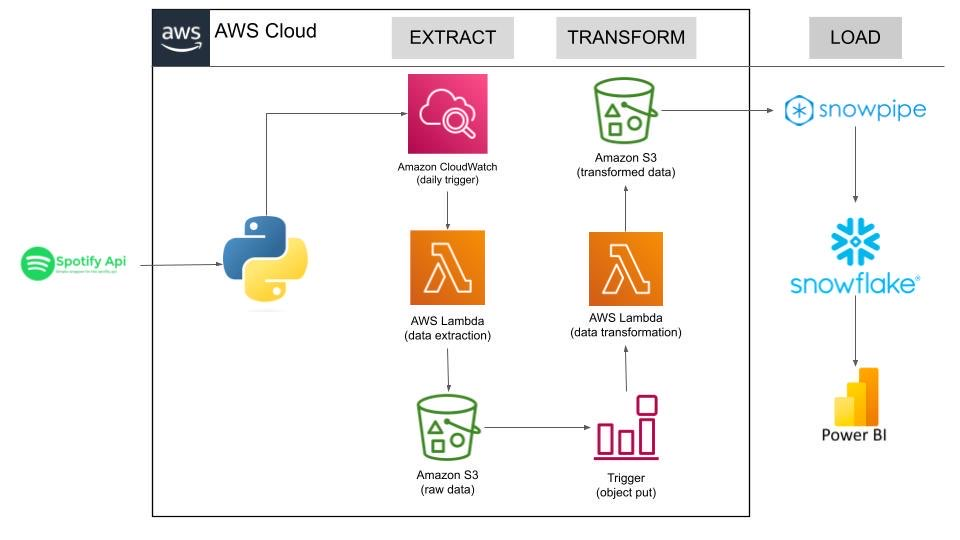

# spotify_de

This data engineering project showcases a complete ETL pipeline built to extract the trending songs using python and spotify API, transform the data and load the data in snowflake database to perform analysis.

## Process

1. Use the spotify API and the spotipy library to extract data. The AWS Lambda service is used for this. It will extract the data and store the raw data on the S3 bucket
2. As soon as the S3 bucket receives the raw data a trigger operation will be performed which will invoke the transformation functon
3. The transformation function will transform the raw data and store it on the S3 bucket
4. Now we load the data from S3 to Snowflake. We acheive this by creating snowpipes.
5. Snowpipes use SNS queue, whenever the transformed data is populated on the S3 bucket, the snowpipe automatically runs and perfroms the given query which populates all the transformed data in the snowflake database
6. Last step is to connect our snowflake database to Power BI or looker studio to perform analysis

**Technologies Used** : Python, Snowflake, AWS, Looker Studio

